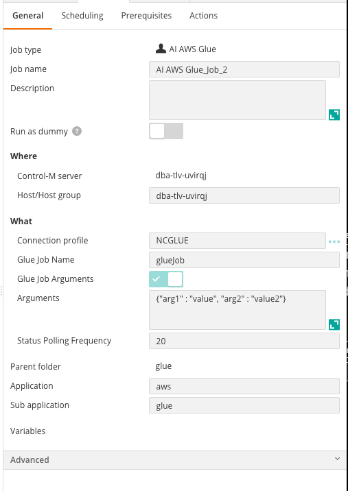

# Control-M AWS Glue plugin
Version 1.0.00

### Short description:
Control-M Integration plugin for AWS Glue.

Created on June-2021
 
### Detailed description:

The AWS Glue plugin for Control-M enables the integration of AWS Glue with the rest of your application 
ecosystem.

In the context of data pipelines this means that a data source may be the start of a pipeline, however, it is not the 
starting point of a business process. A number of steps would be performed prior to a data pipeline being triggered. 
Prior steps could be application based where the data source is generated as an output from the application. 
Automating the end-to-end process provides clear and decisive visibility and management of the entire ecosystem, 
bonding pipelines with supplying applications.

#### Pre requisites

Control-M Version 9.20.000
Fixpack 9.0.20.100
Application pack Patch 9.0.20.101

Note: This plugin is not compatible with bmc Helix Control-M

#### Features

* #### 1. Principal account and IAM 


* #### 2. Trigger pipelines with parameters.



* #### 3. Return the results of the pipeline steps to the output in the Control-M Monitoring domain.  


* #### 4. Integrate AWS Glue pipeline runs with all existing Control-M capabilities.  
    For example : 
                   
        a. Have your pipeline tasks defined in JSON and managed by your cicd process.          
        b. Attach SLA's to your pipeline.
        c. Wait for a b2b source to arrive and process it in an application and run a pipeline based on the outcome.
        d. Attach prior and post dependancy steps to your pipeline for a fully encompassed view of your environment.
        e. A single reference point for the entire lifecycle of your data, from creation to analytics.

* #### 5. Automation API Connection Profile samples

##### Using IAM Role
```
{
  "PROFILENAME": {
    "Type": "ConnectionProfile:ApplicationIntegrator:AI AWS Glue",
    "AI-IAM Role": "iam-role-name",
    "AI-Authentication": "NOSECRET",
    "AI-AWS_REGION": "aws-region",
    "AI-Glue url": "glue-url",
    "Description": "",
    "Centralized": true
  }
}
```
#####  Using access key and secret
```
{
  "ACCESSKEY": {
    "Type": "ConnectionProfile:ApplicationIntegrator:AI AWS Glue",
    "AI-AWS Access key ID": "*****",
    "AI-AWS Secret": "*****",
    "AI-Authentication": "SECRET",
    "AI-AWS_REGION": "aws-region",
    "AI-Glue url": "glue-url",
    "Description": "",
    "Centralized": true
  },
```

* #### 6. Automation API JSON job sample

```
{
  "folderName": {
    "Type": "SimpleFolder",
    "ControlmServer": "SERVER",
    "OrderMethod": "Manual",
    "AI AWS Glue_Job_Name": {
      "Type": "Job:ApplicationIntegrator:AI AWS Glue",
      "ConnectionProfile": "GLUEPROFILE",
      "AI-Glue Job Name": "glue-job",
      "AI-Glue Job Arguments": "unchecked",
      "Host": "hostname",
      "RunAs": "USER"
    }
  }
}
```


