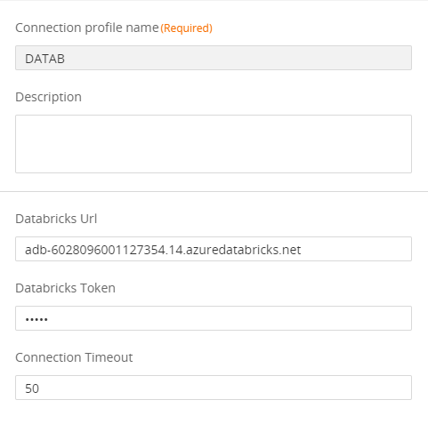
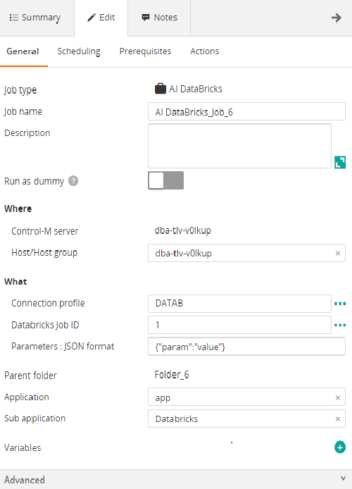
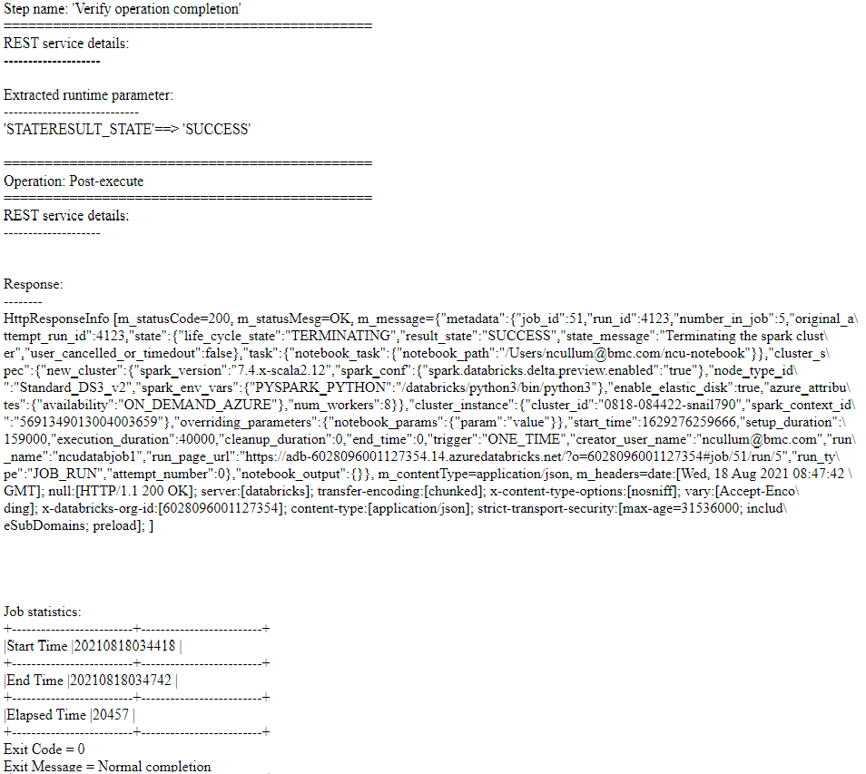

# Control-M Databricks Notebooks plugin
Version 1.0.00

### Short description:
Control-M Integration plugin for Databricks Notebooks jobs based on Databricks REST API 2.0.
Authentication is done using Databricks personal access tokens.

### Detailed description:

Databricks is a cloud "lakehouse" platform that can handle both data warehouse and data lakes workloads.
It allows users to create and run data pipelines, develop and deploy analytics and machine learning models etc.
Databricks is based on Spark, providing automated cluster management and iPython-style notebooks (Databricks data pipelines).

The Darabricks plugin for Control-M enables the integration of Databricks notebooks with your existing Control-M
workflows.

#### Authentication
You generate access token manually in Databricks and update the Connection Profile of the plugin with it.
If you change your keys regularly, its possible to automate the updating process in the Connection Profile.

#### Pre requisites

Control-M Version 9.20.000,
Fixpack 9.0.20.100,
Application pack Patch 9.0.20.101

Note: This plugin is not compatible with bmc Helix Control-M

#### Features

* #### 1. Authentication using Databricks personal access tokens.                

* #### 2. Trigger jobs with parameters based any Notebook.

* #### 3. Return the results of the job steps to the output in the Control-M Monitoring domain.  

* #### 4. Integrate Databricks runs with all existing Control-M capabilities.  
    For example : 
                   
        a. Have your job on Databricks defined in JSON and managed by your cicd process.
        b. Attach SLA's to your pipeline.
        c. Wait for a b2b source to arrive and process it in an application and run a pipeline based on the outcome.
        d. Attach prior and post dependancy steps to your pipeline for a fully encompassed view of your environment.
        e. A single reference point for the entire lifecycle of your data, from creation to analytics.

* #### 5. Avoid connection timeouts and unnecessary job reruns

 

 

