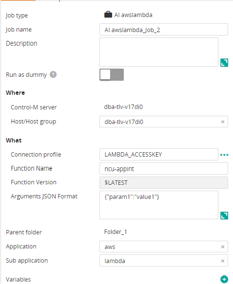
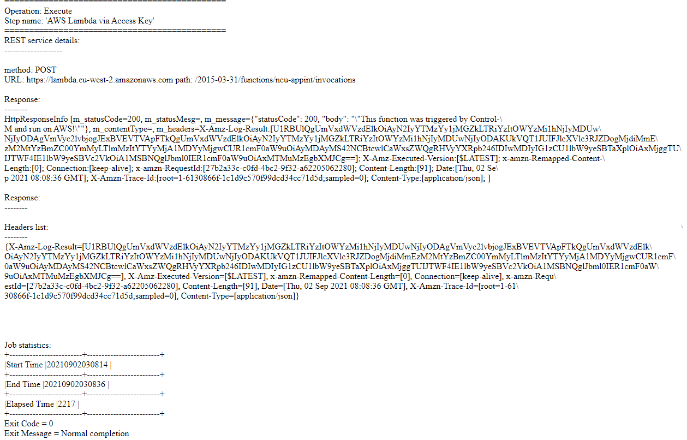

# Control-M AWS Lambda plugin
Version 1.0.00

### Short description
Control-M Integration plugin for AWS Lambda.
 
### Detailed description
AWS Lambda is a serverless compute service where you can write and run code without server management.
AWS Lambda plugin for Control-M enables the integration of AWS Lambda functions with the rest of your application 
ecosystem.
The Lambda function is invoked synchronously by the plugin.

### Authentication
When working with services on AWS infrastructure, IAM role authentication is addressed (AssumeRole).
When working outside of AWS infrastructure, authentication is via access key id and secret key (SigV4).

### Pre requisites
Control-M Version 9.20.000,
Fixpack 9.0.20.100,
Application pack Patch 9.0.20.101

Note: This plugin is not compatible with bmc Helix Control-M

### Features

* #### 1. Principal account (access key and secret) and IAM authentications

#####  Using access key and secret


#####  Using IAM role


* #### 2. Trigger function with arguments

Note: When no arguments Enter {}




* #### 3. Return the result of the function to the output in the Control-M Monitoring domain.  




* #### 4. Integrate AWS Lambda functions runs with all existing Control-M capabilities.  
    For example : 
                   
        a. Have your workflow tasks defined in JSON and managed by your cicd process.          
        b. Attach SLA's to your workflow.
        c. Wait for a b2b source to arrive and process it in an application and run a workflow based on the outcome.
        d. Attach prior and post dependancy steps to your workflow for a fully encompassed view of your environment.
        e. A single reference point for the entire lifecycle of your data, from creation to analytics.


* #### 5. Automation API Connection Profile samples


#####  Using access key and secret
```

  {
  "AWS_ACCESSKEY": {
    "Type": "ConnectionProfile:ApplicationIntegrator:AI awslambda",
    "AI-AWS Access Key": "*****",
    "AI-AWS Secret": "*****",
    "AI-region": "aws-region",
    "AI-url": "lambda-url",
    "AI-Connection Timeout": "50",
    "AI-Authentication Method": "ACCESSKEY",
    "Description": "",
    "Centralized": true
  }

```

##### Using IAM Role
```

"AWS_IAMROLE": {
    "Type": "ConnectionProfile:ApplicationIntegrator:AI awslambda",
    "AI-IAM Role": "iam-role-name",
    "AI-AWS Access Key": "*****",
    "AI-AWS Secret": "*****",
    "AI-region": "aws-region",
    "AI-url": "lambda-url",
    "AI-Connection Timeout": "50",
    "AI-Authentication Method": "IAMROLE",
    "Description": "",
    "Centralized": true
  },
```


* #### 6. Automation API JSON job sample

```

  "folderName": {
    "Type": "SimpleFolder",
    "ControlmServer": "SERVER",
    "OrderMethod": "Manual",
    "AI awslambda_Job_name": {
      "Type": "Job:ApplicationIntegrator:AI awslambda",
      "ConnectionProfile": "AWS_ACCESSKEYS",
      "AI-Function Name": "function-name",
      "AI-Arguments : JSON format": "{}",
      "SubApplication": "lambda",
      "Host": "SERVER",
      "RunAs": "AWS_ACCESSKEYS",
      "Application": "aws"
    }
  


```


