<H1>Sample integration of Control—M with SAP Business Objects</H1>

==========================================================

**Note:All trademarks are property of their respective owners**

## Table of Contents

1. [SAP BO prerequisites](#sap-business-object-prerequisites)

2. [Application Integrator: create the plugin](#application-integrator-create-the-plugin)

3. [Add a Connection Profile Attribute in the "Attribute Management" tab](#add-a-connection-profile-attribute-in-the-attribute-management-tab)

4. [Create the Form](#create-the-form)

5. [Step Pre-Execution : Get SAP Token](#step-pre-execution-get-sap-token)

6. [Step Get Report ID from CUID](#step-get-report-id-from-cuid)

7. [Step PUB Schedule Now](#step-pub-schedule-now)

8. [Sub-step PUB Schedule Now : Verify operation completion](#sub-step-pub-schedule-now-verify-operation-completion)

9. [Step Document Schedule now](#step-document-schedule-now)

10. [Sub-step Document Schedule: Manual abort operation](#sub-step-document-schedule-manual-abort-operation)

11. [Sub-step Document Schedule: Verify operation completion](#sub-step-document-schedule-verify-operation-completion)

12. [Post-execution : logoff](#post-execution-logoff)

13. [Publish and Deploy your job type](#publish-and-deploy-your-job-type)

14. [Use your new job type in Control-M](#use-your-new-job-type-in-control-m)

**\
**

**Control-M V21 Application Integrator\
***Example of how to create a REST API Integration with SAP Business
Objects*

**Introduction**

Application Integrator is a low code approach to creating an integration
with Control-M. The integrations are built in a UI designer**.**

This documentation shows an example contributed by a Control-M customer
who runs SAP Business Objects. It outlines a series of steps that can be
taken by customers to establish a basic integration with SAP Business
Objects. The document is provided as-is for your convenience, and is not
supported by BMC.

## SAP Business Object prerequisites
| **Parameter** | **Value** |
| --- | --- |
| REST API endpoint | http(s)://server_name:6405/biprws |
| User | | 
| Password | | 
| Authentication | secEnterprise,secLDAP,secWinAD,secSAPR3|

## Application Integrator: create the plugin

-   Enter your credentials in the login screen

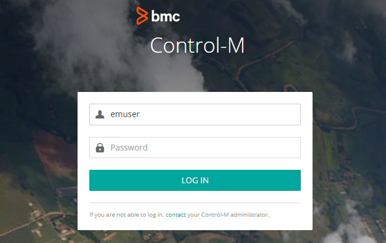

-   Click on \"Add Plug-in\"

-   Name your job type and select REST API as the Steps Default
    Interface

##  Add a Connection Profile Attribute in the "Attribute Management" tab 

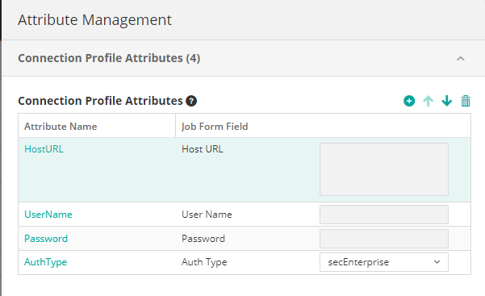

-   HostURL, UserName are Text Box

-   Password is type Password

    

-   AuthType is 'DropDown List' with Format

    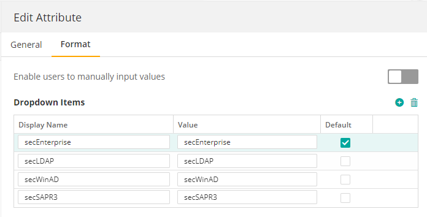

## Create the Form

-   Job Definition

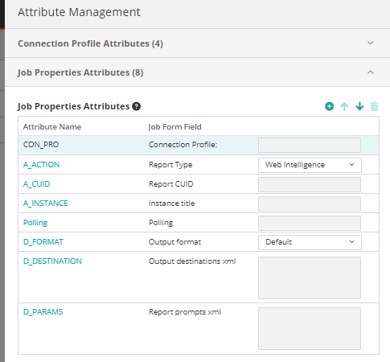

| **Attribut** | **Format** |
| --- | --- |
| Report Type  | Dropdown List  |
| Report CUID | Text Box  | 
| Instance title | Text Box  | 
| Polling | Text Box, default value 20 |
| Outut Format | Dropdown List  |
| Output   Destinations xml | Text Area |
| Report Prompts   xml | Text Area |

+-------------------+--------------------------------------------------+
| **Attribut**      | **Format**                                       |
+===================+==================================================+
| Report Type       | Dropdown List                                    |
|                   |                                                  |
|                   |  							   |
|                   |                    						       |
+-------------------+--------------------------------------------------+
| Report CUID       | Text Box                                         |
+-------------------+--------------------------------------------------+
| Instance title    | Text Box                                         |
+-------------------+--------------------------------------------------+
| Polling           | Text Box, default value 20                       |
+-------------------+--------------------------------------------------+
| Outut Format      | Dropdown List                                    |
|                   |                                                  |
|                   |                             |
+-------------------+--------------------------------------------------+
| Output            | Text Area                                        |
| Destinations xml  |                                                  |
+-------------------+--------------------------------------------------+
| Report Prompts    | Text Area                                        |
| xml               |                                                  |
+-------------------+--------------------------------------------------+

-   Form customization

    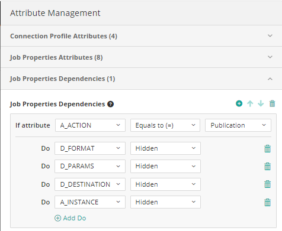

##  Step Pre-Execution : Get SAP Token

-   REST API tab

    \
    

The body is:

{\"userName\":\"{{UserName}}\",\"password\":\"{{Password}}\",\"auth\":\"{{AuthType}}\"}

-   Output Handling tab

    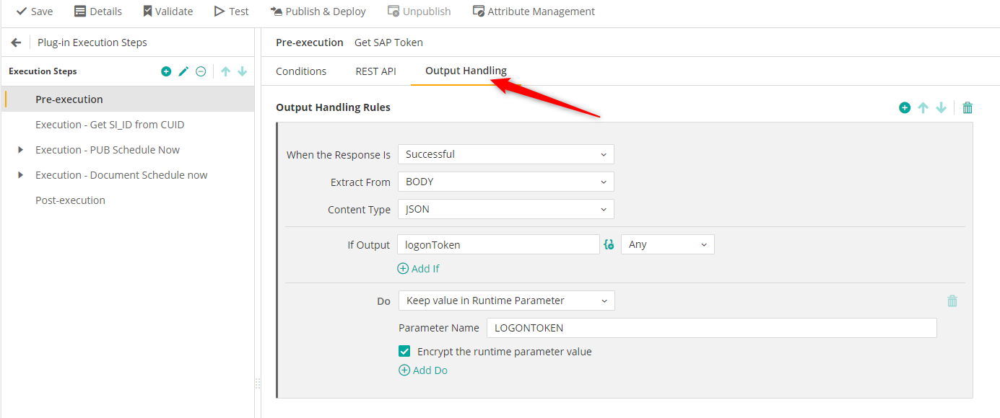

##  Step Get Report ID from CUID

-   REST API tab

Body is :

{\"query\":\"SELECT SI_ID FROM CI_INFOOBJECTS WHERE si_cuid=\'{{A_CUID}}\'\"}

-   Output Handling tab

    

##  Step PUB Schedule Now

This step will run the Publication report.

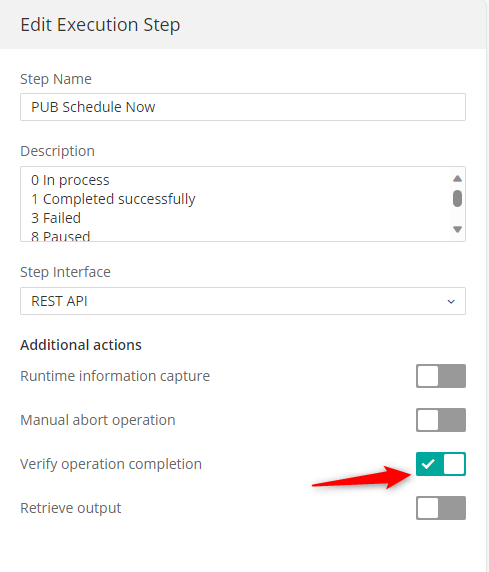

-   Conditions tab

    

-   REST API tab

    

URL is:

v1/publications/{{V_SI_ID}}/schedules/schedule/now

-   Output Handling tab

    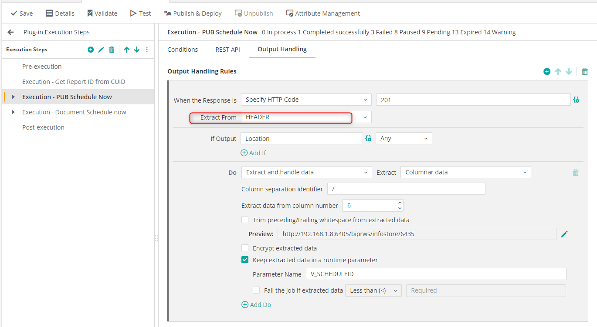

## Sub-step PUB Schedule Now : Verify operation completion

This sub-step runs loop till a specific value is captured in the Json
response.

-   REST API tab

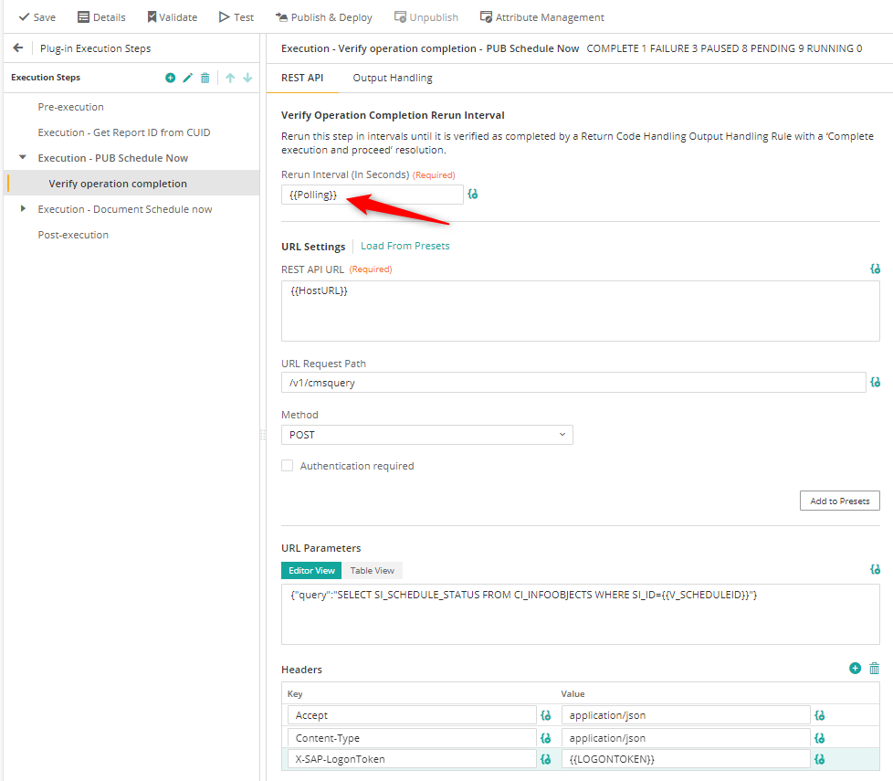

The query is:

{\"query\":\"SELECT SI_SCHEDULE_STATUS FROM CI_INFOOBJECTS WHERE
SI_ID={{V_SCHEDULEID}}\"}

-   Output Handling tab

    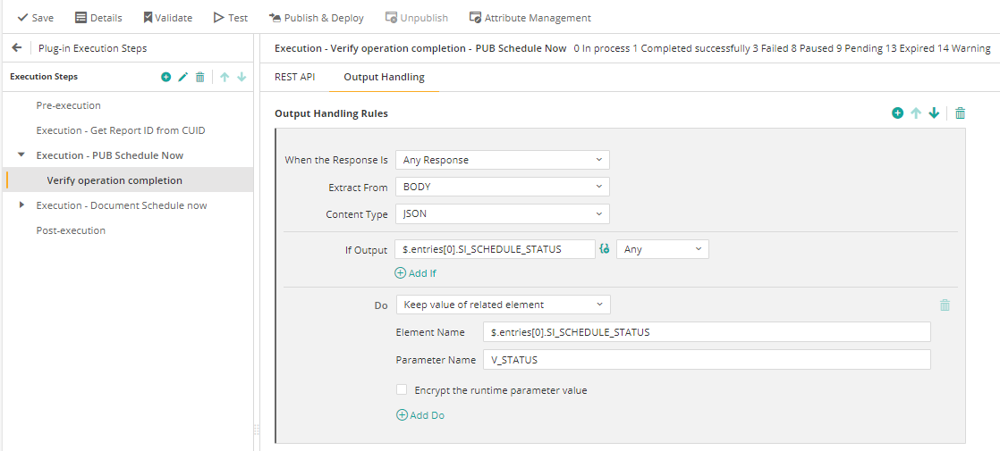\
    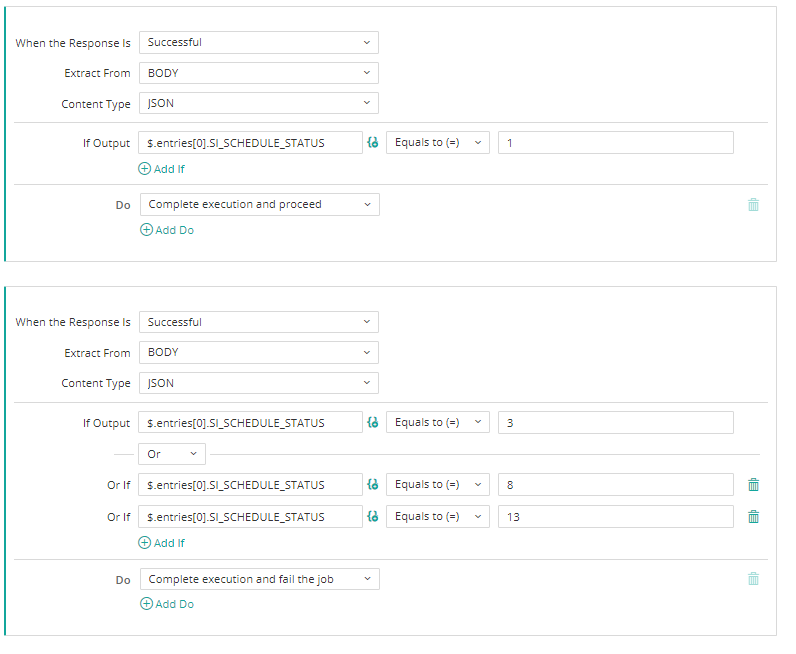

## Step Document Schedule now

Add the step with these 2 options

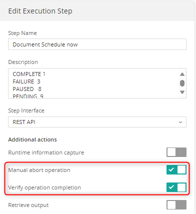{width="3.141087051618548in"
height="3.4295527121609797in"}

-   REST API tab

    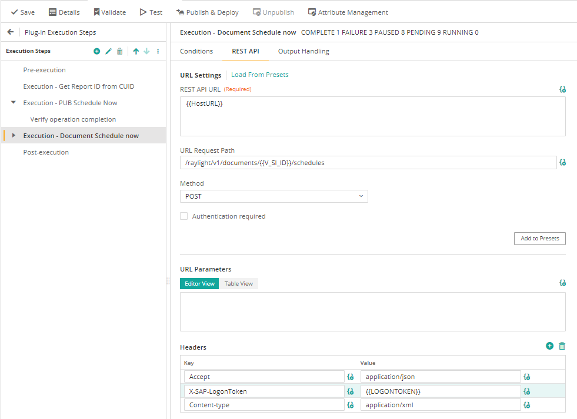\
    

The body is:

\<schedule\>

\<name\>{{A_INSTANCE}}\</name\>

{{D_FORMAT}}

{{D_DESTINATION}}

{{D_PARAMS}}

\</schedule\>

-   Output Handling tab

    

## Sub-step Document Schedule: Manual abort operation

-   REST API tab

    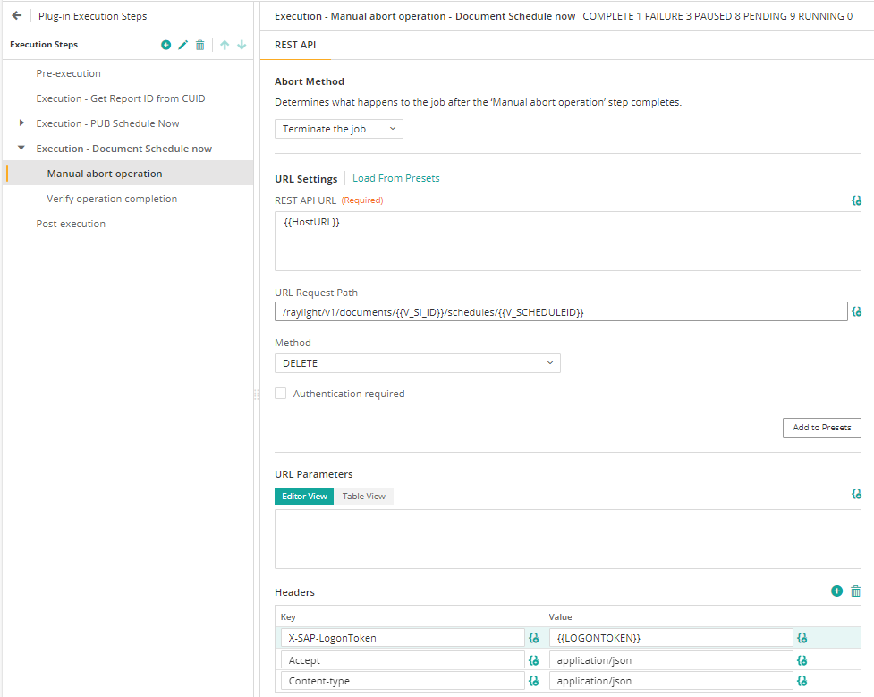

## Sub-step Document Schedule: Verify operation completion

REST API tab and Output Handling tab are the same as 8.

## Post-execution : logoff

-   REST API tab

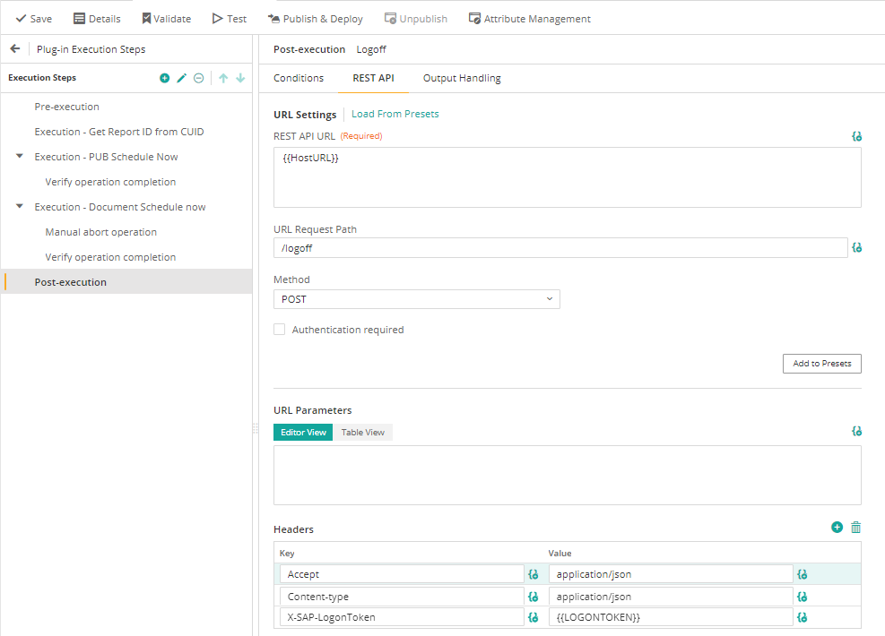

## Publish and Deploy your job type

Select \"Publish & Deploy\"\

If this window pop-ups, you can publish with Warnings

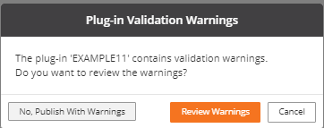

Select an Agent an Apply.

If none Agent is present, then deploy he Application Pack/Application
Integrator plugin to an agent.

##  Use your new job type in Control-M

Log in to the Control-M web environment

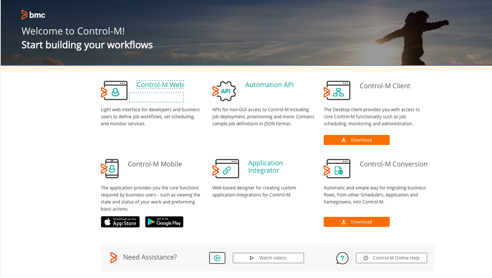

-   Create a new centralised connection profile for your job type:

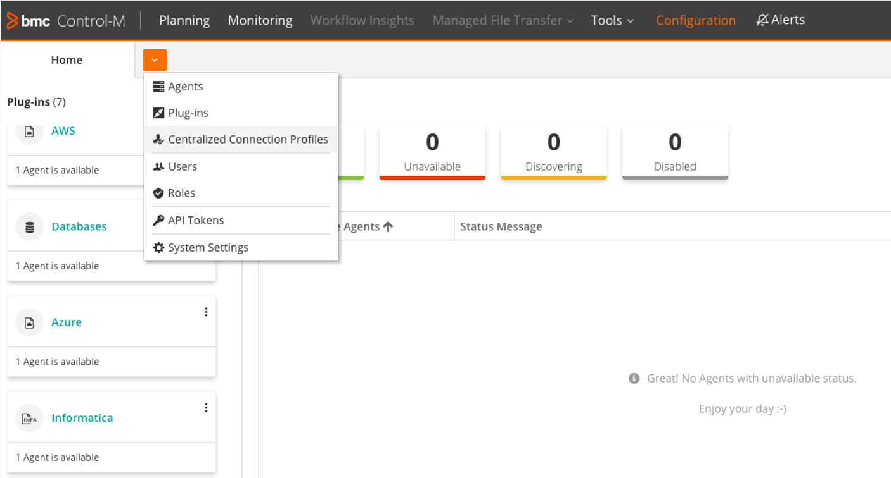

Click on Add Connection Profile

Give your connection profile a name and populate the fields from your AI
job in the
blade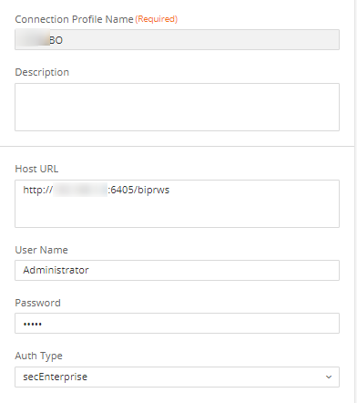

-   Create a new job from your job type in the palette in the Planning
    Domain

